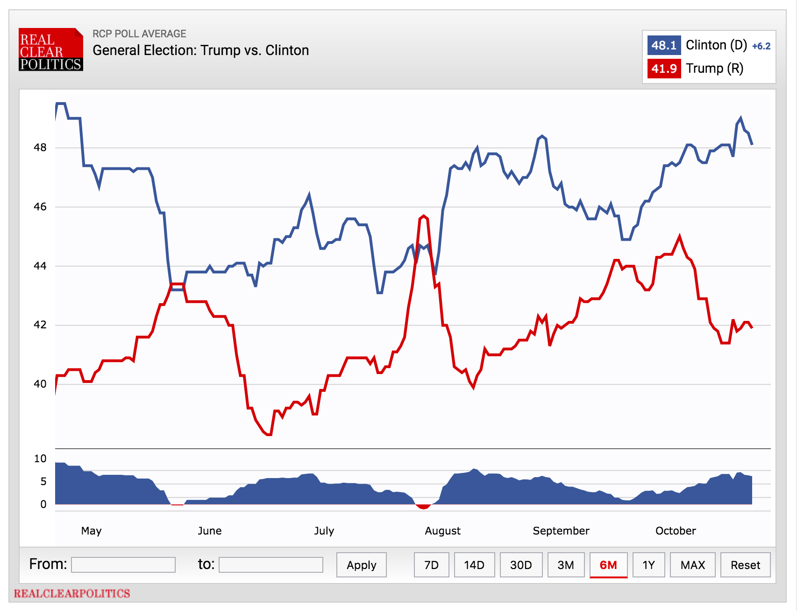
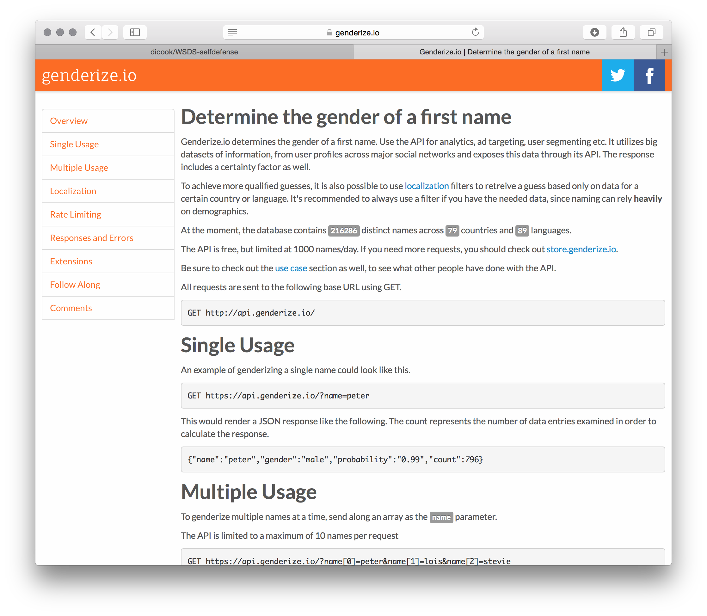

```{r setup, include=FALSE}
knitr::opts_chunk$set(message = FALSE, warning = FALSE, cache = TRUE)
library(dplyr)
```

# Empowering Women with Self-defense Skills using R


## The Instructors {.smaller}

<div class="columns-2">
  
  
  

<br>
Heike Hofmann<br>
Professor<br>
Department of Statistics<br>
Iowa State University<br><br>


Dianne Cook<br>
Professor<br>
Department of Econometrics and Business Statistics
Monash University<br><br>

  
  
Sam Tyner<br>
PhD Candidate<br>
Department of Statistics<br>
Iowa State University<br><br>

</div>

## Plan for the Workshop


1. Scraping polling data <br>

2. genderizer package/API <br>

3. Female authors of R packages<br><br>


## Follow along

All Resources are available from GitHub at [https://github.com/dicook/WSDS-selfdefense](https://github.com/dicook/WSDS-selfdefense)

- Download the repo (zip or download to desktop)

- Double-click the R project WSDS-selfdefense.Rproj

- slides.Rmd contains this set of slides (and the code)


# Scraping the web

## An Example {.smaller}

The website RealClearPolitics tracks poll results for this presidential election

Polls of Clinton versus Trump at the national level available at 
[http://www.realclearpolitics.com/epolls/2016/president/us/general_election_trump_vs_clinton-5491.html](http://www.realclearpolitics.com/epolls/2016/president/us/general_election_trump_vs_clinton-5491.html)



## The Goal of this exercise is to 

- get the polls from the RCP website
- clean the data
- visualize it

## Scraping the data

- resources used:   `rvest` and `xml2` packages

- general code idea:

```
url <- "your url goes here"
doc <- xml2::read_html(url)
tables <- tidyr::html_table(doc)
```
`tables` consists of a list of all tables at the specified URL

## RCP national polls

```{r}
url <- "http://www.realclearpolitics.com/epolls/2016/president/us/general_election_trump_vs_clinton-5491.html"
doc <- xml2::read_html(url)
tables <- rvest::html_table(doc)
tables %>% purrr::map(.f = dim)
```

## Raw data {.smaller}

```{r}
raw <- tables[[4]]
tail(raw)
```

First impressions: 224 polls dating back to May ... but that's May 2015!

## Data Cleaning Checklist


- the poll names in `Poll` are strange
- the dates in `Date` need to be separated into a start date and end date
- the variable `Sample` consists of two pieces of information: the number of participants and the type of voters
- the variable `Spread` consists of multiple pieces, but that doesn't matter
- rename variables: Clinton (D) and Trump (R) to Clinton and Trump
- we need to convert the date variables into actual dates
- use only the first 118 poll results (all polls since July 2016)
- the first value is `RCP Average` - that's not a poll

## Data Cleaning (1) {.smaller}

- the dates in `Date` need to be separated into a start date and end date

```
separate <- function (data, col, into, sep = "[^[:alnum:]]+", remove = TRUE, 
    convert = FALSE, extra = "warn", fill = "warn", ...) 
```

```{r}
library(tidyr)
polls <- raw %>% separate(Date, into = c("Start_Date", "End_Date"), sep = " - ")
head(polls)
```

## Data Cleaning (2) {.smaller}

- Convert the date information into a date type (POSIXct)
- Use only polls since July 2016

```{r}
library(lubridate)
polls <- raw[1:118, ] %>% 
  separate(Date, into = c("Start_Date", "End_Date"), sep = " - ") %>%
  mutate(
    Start_Date = ymd(paste("2016", Start_Date, sep = "/")),
    End_Date = ymd(paste("2016", End_Date, sep = "/"))
  ) 

str(polls)
```

## Data Cleaning (3) {.smaller}

- Separate the variable `Sample` into two pieces of information
- Convert `Number` to a numeric variable
- Remove first record

```{r}
polls <- polls %>%
  separate(Sample, into = c("Number", "Type")) %>%
  mutate(
    Number = as.numeric(Number)
  ) %>% filter(Poll != "RCP Average")
names(polls)[7:8] <- c("Clinton", "Trump")

str(polls)
write.csv(polls, file= "data/polls.csv", row.names=FALSE)
```

## Data cleaning recap

- Getting the data was much easier than cleaning it
- Generalization of data cleaning not possible
- Cleaning poll names out of reach for now
- Resources for cleaning: `lubridate` (dates and times), `tidyr` (data wrangling), `dplyr` (data flow)


... and we are not done yet!

Nest steps: 

- combine all pollsters with fewer than five polls into `Other`
 

## Data Cleaning (4) {.smaller}

```{r}
library(ggplot2)
polls <- polls %>% mutate(
    Poll = reorder(Poll, Poll, length)
  ) 
polls %>% 
  ggplot(aes(Poll)) + geom_bar() + coord_flip()
```

## Data Cleaning (5) {.smaller}

- combine all pollsters with fewer than five polls into `Other`

```{r fig.height =4}
levels(polls$Poll)[1:15] <- "Other"

polls %>% 
  ggplot(aes(Poll)) + geom_bar() + coord_flip()
```

## Visualization

```{r echo = FALSE, fig.height = 5.5, fig.width = 9, fig.align = "center"}
library(ggplot2)
brewer_cols <- RColorBrewer::brewer.pal(9, "Paired") # only palette with nine values without grey

polls %>% 
  ggplot(aes(x = End_Date, y = Clinton - Trump)) +
    annotate("text", x = ymd("2016/07/1"), y = 10, label = "Clinton", 
             size = 30, colour = "grey90", hjust=0) +
    annotate("text", x = ymd("2016/07/1"), y = -10, label = "Trump", 
             size = 30, colour = "grey90", hjust=0) +
    geom_hline(yintercept = 0, colour = "grey80") + 
    geom_smooth(se = FALSE, colour = "grey50") +
    geom_point(aes(colour = Poll), size = 2.5) +
    geom_segment(aes(colour = Poll, yend = Clinton - Trump, xend = Start_Date)) +
    theme_bw() + 
    theme(legend.position = "bottom") + 
    scale_colour_manual("Pollster", values = c("grey70", brewer_cols), 
                        guide = guide_legend(nrow = 3)) +
  ylim(c(-15, 15)) +
  ylab("Percentage Point Difference") +
  xlab("Date")
```

## Code for Visualization {.smaller}

```
library(ggplot2)
brewer_cols <- RColorBrewer::brewer.pal(9, "Paired") # only palette with nine values without grey

polls %>% 
  ggplot(aes(x = End_Date, y = Clinton - Trump)) +
    annotate("text", x = ymd("2016/07/1"), y = 10, label = "Clinton", 
             size = 30, colour = "grey90", hjust=0) +
    annotate("text", x = ymd("2016/07/1"), y = -10, label = "Trump", 
             size = 30, colour = "grey90", hjust=0) +
    geom_hline(yintercept = 0, colour = "grey80") + 
    geom_smooth(se = FALSE, colour = "grey50") +
    geom_point(aes(colour = Poll), size = 2.5) +
    geom_segment(aes(colour = Poll, yend = Clinton - Trump, xend = Start_Date)) +
    theme_bw() + 
    theme(legend.position = "bottom") + 
    scale_colour_manual("Pollster", values = c("grey70", brewer_cols), 
                        guide = guide_legend(nrow = 3)) +
  ylim(c(-15, 15)) +
  ylab("Percentage Point Difference") +
  xlab("Date")
```
## Visualization Recap

- there is huge variability in polls and between pollsters
- house bias of some pollsters is enormous (cf. LA Times versus NBC News)


# Your Turn

## Exercise

- RealClearPolitics shows all state-level poll results from last week at [http://www.realclearpolitics.com/epolls/latest_polls/state/](http://www.realclearpolitics.com/epolls/latest_polls/state/)
- Read the data from the website
- Identify the data format
- Make a plan for processing the data
- Start working on this process for one of the data sets
- Assess the possibility of automating the process (i.e. write function, use repeatedly)

# genderize

## Genderize



## `genderizeR` package {.smaller}

Kamil Wais (2016). genderizeR: Gender Prediction Based on First Names. R
  package version 2.0.0. https://CRAN.R-project.org/package=genderizeR
  
```{r}
library(genderizeR)

givenNames <- findGivenNames(c("heike", "di", "sam", "samantha"))
```

## `genderizeR` results

```{r}
givenNames
```

- results from findGivenNames build database to be used in `genderize` function 
- genderize.io API restricts to at most free 1000 checks a day
- `findGivenNames` allows for country specification 

# R package authors
